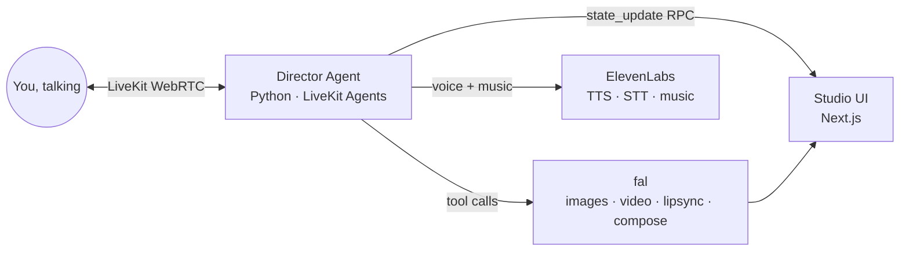

# Director FAL

**The video editor you talk to.**

Direct AI video with your voice — brainstorm a story, cast your characters, watch the
film render, then say *"around 15 seconds, make her say 'I really love you' instead"*
and watch the timeline fix itself. No mouse. No timeline dragging. Just direction.

Built in 72 hours for the [fal x Sequoia Video Hackathon](https://www.72hourhackathon.com/) — Developer Track.

## How it works



- **fal** renders everything you see: character portraits, storyboard stills,
  video shots, lipsync fixes, and the final multi-format export (ffmpeg compose).
- **ElevenLabs** is every voice you hear: the agent's voice, the characters'
  dialogue, and the soundtrack.
- **LiveKit** is the conversation: you're on a call with your editor.

## Monorepo

| Path | What |
|---|---|
| `frontend/` | Next.js — cinematic landing + the Studio (preview, timeline, transcript, talk orb) |
| `agent/` | Python LiveKit agent — the director: brainstorm, cast, render, edit, export |
| `SPEC.md` | The build spec / single source of truth |

## Run it locally

Everything runs on localhost — no database, no cloud. LiveKit runs in dev mode,
so it needs **no account**; you only bring keys for Anthropic, Deepgram,
ElevenLabs, and fal.

```bash
# prerequisites: ffmpeg, uv, node/pnpm, and livekit-server (brew install livekit)

# 1. keys
cp agent/.env.example    agent/.env.local     # add ANTHROPIC / DEEPGRAM / ELEVENLABS / FAL keys
cp frontend/.env.example frontend/.env.local  # LiveKit dev values are prefilled

# 2. install
cd agent && uv sync && cd ..
cd frontend && pnpm install && cd ..

# 3. run all three (livekit-server + agent + web) with one command
./dev.sh
```

Open http://localhost:3000 and press the talk orb. Without keys, `/studio`
shows a setup screen (not a fake studio) telling you exactly what's missing.

**Test the edit engine with zero keys** — drive the real ffmpeg pipeline and
render an actual mp4:

```bash
cd agent && uv run python -m src.repl --script demo   # -> agent/test-output/repl-demo.mp4
uv run pytest -q                                       # 23 engine tests, real renders
```

---
*Created entirely during the hackathon window, July 17–19, 2026.*
