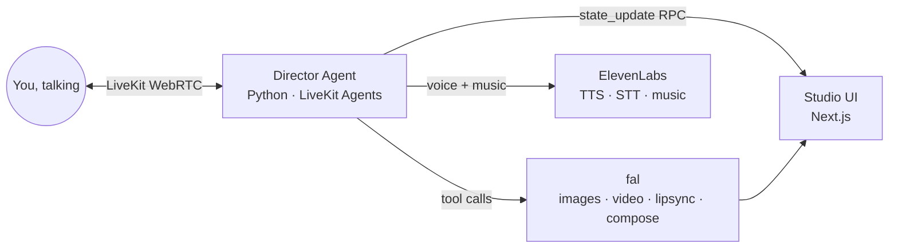

# Director FAL

**The video editor you talk to.**

Direct AI video with your voice — brainstorm a story, cast your characters, watch the
film render, then say *"around 15 seconds, make her say 'I really love you' instead"*
and watch the timeline fix itself. No mouse. No timeline dragging. Just direction.

Built in 72 hours for the [fal x Sequoia Video Hackathon](https://www.72hourhackathon.com/) — Developer Track.

## How it works



- **fal** renders everything you see: character portraits, storyboard stills,
  video shots, lipsync fixes, and the final multi-format export (ffmpeg compose).
- **ElevenLabs** is every voice you hear: the agent's voice, the characters'
  dialogue, and the soundtrack.
- **LiveKit** is the conversation: you're on a call with your editor.

## Monorepo

| Path | What |
|---|---|
| `frontend/` | Next.js — cinematic landing + the Studio (preview, timeline, transcript, talk orb) |
| `agent/` | Python LiveKit agent — the director: brainstorm, cast, render, edit, export |
| `SPEC.md` | The build spec / single source of truth |

## Run it

```bash
# 1. agent
cd agent && uv sync && cp .env.example .env.local  # fill keys
uv run python src/agent.py dev

# 2. frontend
cd frontend && pnpm install && cp .env.example .env.local  # fill keys
pnpm dev
```

Open http://localhost:3000, enter the studio, and start talking.
No keys yet? Set `MOCK_MEDIA=1` and everything runs with placeholder media.

---
*Created entirely during the hackathon window, July 17–19, 2026.*
